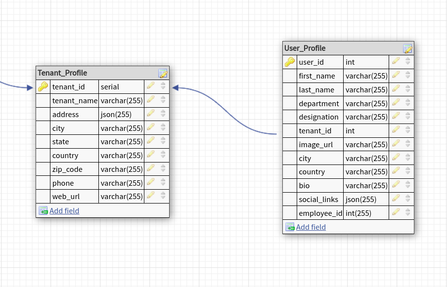

# **Ventnurenox** Associate Backend Engineer Hiring Test

## Overview:
The aim of this assessment is to evaluate your backend skills in Python within a microservices framework. This assessment will involve creating a web application wherein you will expose API endpoints, interface with a database using an ORM, and produce/consume events through Kafka.


## Techstack:
- ### FastAPI (API Framework)
- ### SQLAlchemy (ORM)
- ### confluent-kafka
*Note: you may use whichever ORM are comfortable with.*

## Assistive Technology (provided in the starter code)
- ### Docker Compose
- ### Postgres
- ### Adminer
- ### Kafka
- ### UI for Apache Kafka


## **Assessment**:

For this assessment you will be using the following ERD. It comprises of two tables linked by a one-to-many relationship.



## **Task 0**: Running the repo
The repo has been created in a microservice fashion using docker and docker compose. In order to run the whole repo use the following command to run all the services/containers:

```make start```

To stop all containers use the following command:

```make stop```

*Note: For every change that you make in the code, in order to rerflect those you need to re-run the project using the first command given in this section.*

If you dont have docker and docker-compose setup in your system consult the installation guide relevant to your system on Docker's offical website.

### **NOTE: A service named ```social``` has already been setup with kafka for you to work in. Start working in *```./backend/social/```***


## **Task 1**: Checking the Sample web server code
Study the starter code for the web service provided. In which a sample web server has been created for you with a sample router/endpoint in it. You are to run the endpoint successfully via browser or Postman to check if you able to run the web app successfully.


## **Task 2**: Creating the database using ORM
Using the ERD provided above create the database using an ORM. Throughout this assessment you are required to use only the ORM to interact with the database and the tables inside of it. Add this code to the web server starter code provided.

### Postgres Credentials
Postgres credentials are provided via enviornment variables. You can access Adminer which is a GUI for interacting with the postgres database. You can access adminer at `http://localhost:8090/` once you start the project. You may use the following credentials to login to adminer in the .env file present at the root of the project.
```
- POSTGRES_HOST
- POSTGRES_USERNAME
- POSTGRES_PASSWORD
- POSTGRES_DATABASE 
```

## **Task 3**: Adding routes/endpoints
For the tables in the database you are to create separate API group(s). In each API group you will have the following category of endpoint with the described funcitonality:
- POST - add data to the corresponding database table, data has to be passed as a raw request in JSON.
- GET - get all data from the corresponding database table
- GET - get specific record based on the ID of the record, this ID has to be passed as a path parameter when requesting the route/endpoint.
- DELETE - delete specific record for the correspinding database table, this ID has to be passed as a path parameter when requestion the route/endpoint.
- PATCH - alter a specific record specified by ID in the corresponding database table, this ID has to be passed as a path parameter when requesting the route/endpoint.

## **Task 4:** Implementing Kafka consumer
Social service contains a file `utils/process_msg.py` file. The process_msg processes the consumed data.

For this task a Kafka server has already been setup and utility functions have been provided in order to seamlessly connect and communicate with the topics. You are to use this provided code of a consumer in order to consume messages from a specific topic (specified in Kafka utility code), parse them and insert the consumed messaged in appropriate database tables.

You can observe the produced/consumed messages in the "UI for Apache Kafka" accessible at `localhost:8085` once you start the project.
